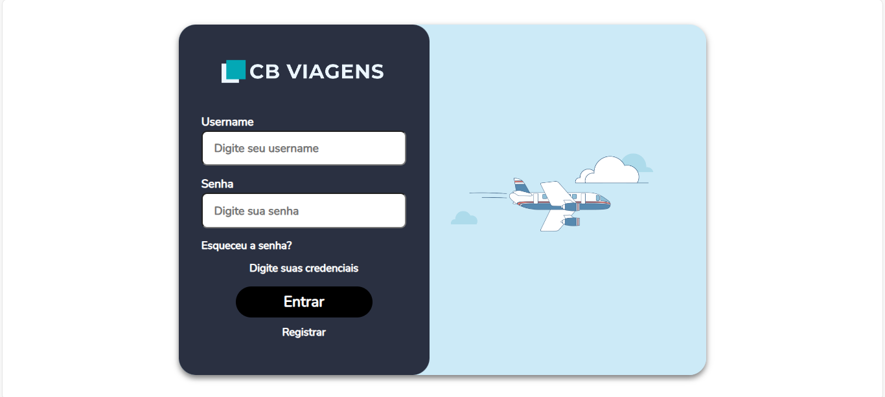

# CB Viagens
Site de uma empresa fictícia de 

## Imagens

## Documentações
- Documentação do Frontend (Vue): [documentação](cb_viagens/README.md)
- Documentação do Backend (Django): [documentação](cb_viagens_api/README.md)

## Frontend
- Para o frontend, utilizei Vue.js para implementar uma Landing Page, Página de Login, Página de Cadastro e Dashboard com algumas seções. Prezei por uma interface simples de usar, porém agradável aos olhos, com cores e layouts que combinassem com o protótipo e logo que foram enviados;
- O uso de animações simples para garantir a fluidez na experiência do usuário foi constante, principalmente para a entrada de modals e mount de páginas;
- Utilizei algumas bibliotecas externas, como **Vuex para o gerenciamento do token** ou o **vue-date-picker** para obter o modal necessário para a escolha da data. Além de criar types específicos para que as responses do servidor fossem devidamente processadas;
- O design do site foi pensado para manter a estética de aviões. Com ícones e artes relacionadas ao tema nos lugares cabíveis;
No Dashboard, adicionei algumas seções extras para que o site se torne mais completo, como **Minhas Viages** ou a seção informativa **Sobre Nós**;

## Backend
- Os models das viagens foram moldados de acordo com os dados enviados em **data.json**, com exceção de algumas propriedades que foram usadas para funcionalidades extras do site, como o campo **CustomerId** que é usado para o agendamento de viagens;
- Já os models foram pegos da biblioteca nativa do Django, com o uso da biblioteca **Djoser** para o gerenciamento do processo de autenticação;
- Foram criadas rotas auxiliares para o frontend, como a rota **/trips/cities**, que retorna todas as cidades com viagens disponíveis para que o input futuramente vire um autocomplete;

## Como Executar
Para executar o projeto, basta executar [sh_file](run.sh)
