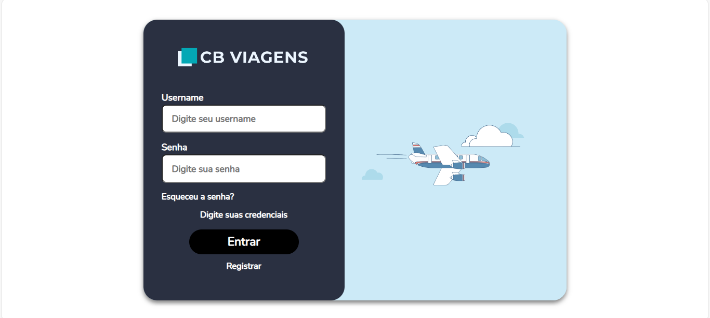

# Frontend da CB Viagens feito com Vue.js!
Com esta interface podemos conferir e manusear as informações guardadas no servidor!

## Imagens



## Requerimentos
- Node.js;
- Npm / Yarn;
- Vue Cli;

## Páginas
- Landing Page - "/";
- Página de login - "/signin";
- Página de cadastro - "/signup";
- Dashboard - "/dashboard"
- Calcular Viagem - (Seção do dashboard);
- Viagens Comfort - (Seção do dashboard)
- Minhas Viagens - (Seção do dashboard);
- Sobre Nós - (Seção do dashboard);

## Bibliotecas Utilizadas
- vue-datepicker: ^8.3.1;
- pinia: ^2.1.7;
- vue: ^3.4.21;
- vue-router: ^4.3.0;

## Como Executar
_O projeto está sendo executado na port 8080, caso tenha outra preferência, altere em vite.config.ts_
Para executar o projeto inteiro (backend e frontend), você pode executar /app/run.sh ou seguir este passo a passo (apenas front).

### Passo 1: Setup
Caso queira definir uma URL própria para a API, crie um arquivo _.env_ na raíz do projeto e defina

```.env
VITE_API_URL=<URL_da_sua_API>
```

_Este passo não é necessário. Casa nada seja definido, as requests serão feitas para a API oficial_

```sh
# Só é necessário executar este comando na primeira vez
npm install
```

### Passo 2: 
Compilar e Hot-Reload (Desenvolvimento)
```sh
npm run dev
```

Type-Check, Compilar e Minificar (Produção)
```sh
npm run build
```

### Lint com [ESLint](https://eslint.org/)

```sh
npm run lint
```
